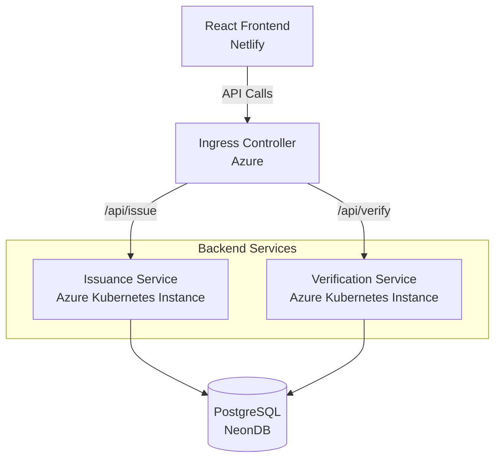
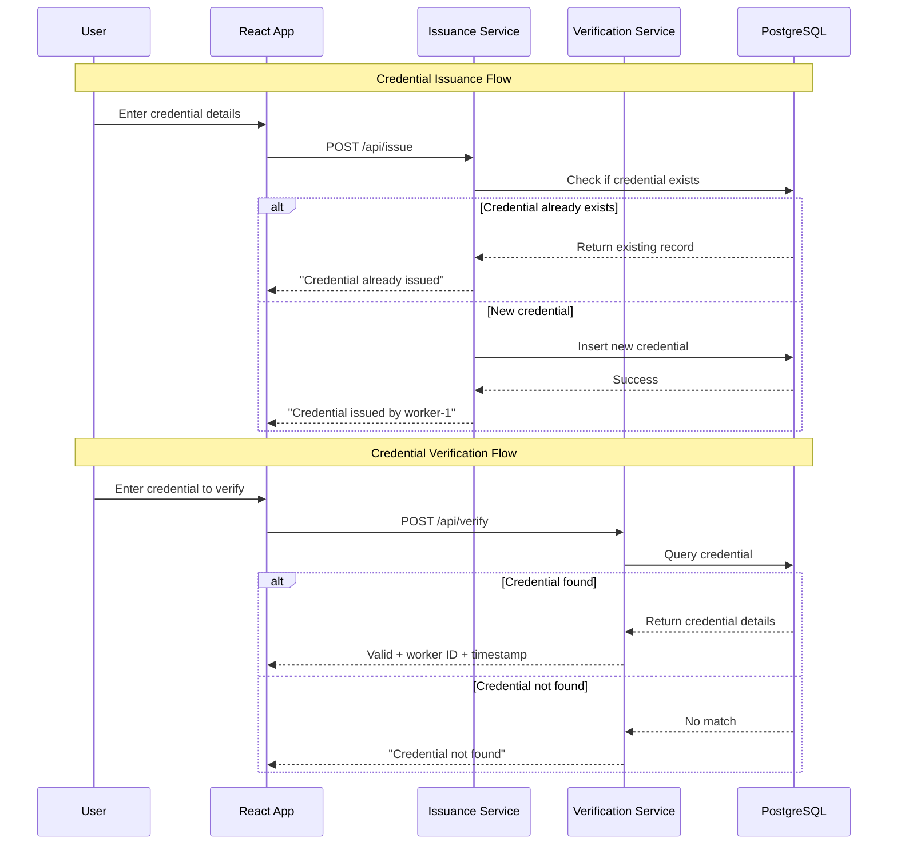

# Kube-Credential — Full Stack Microservices Application


---

## 🚀 Live Application

- **Frontend**: [https://68e93349a66cd580d84e579d--kube-credential-zupple.netlify.app](https://68e93349a66cd580d84e579d--kube-credential-zupple.netlify.app/)
- **Issuance Service**: [https://kubecred.duckdns.org/api/issue](https://kubecred.duckdns.org/api/issue)
- **Verification Service**: [https://kubecred.duckdns.org/api/verify](https://kubecred.duckdns.org/api/verify)

---

## Project Overview

KubeCredential is a microservices-based credential management system that allows users to issue and verify digital credentials. The application consists of two independent backend microservices and a React frontend, all connected to a shared PostgreSQL database.

### Assignment Requirements Fulfilled

✅ **Two Microservices**: Separate services for credential issuance and verification  
✅ **Node.js + TypeScript**: Backend services built with TypeScript  
✅ **React + TypeScript**: Frontend with two pages for issuance and verification  
✅ **Docker Containerization**: All services containerized with Dockerfiles  
✅ **Kubernetes Deployment**: Complete K8s manifests for deployment  
✅ **Cloud Hosting**: Services deployed on Azure, frontend on Netlify  
✅ **Unit Testing**: Jest test suites for both services  
✅ **JSON Credential Handling**: APIs accept and process JSON credentials  
✅ **Worker Identification**: Returns worker ID in response format  
✅ **Database Persistence**: PostgreSQL (NeonDB) for data storage

---

## System Architecture



---

## Application Flow



---

## Technology Stack

### Frontend
- **React 18** with TypeScript
- **Vite** for build tooling
- **Tailwind CSS** for styling
- **Axios** for API communication
- **Deployed on Netlify**

### Backend Services
- **Node.js** with TypeScript
- **Express.js** framework
- **PostgreSQL** database (NeonDB)
- **Jest** for unit testing
- **Docker** containerization
- **Deployed on Azure**

### Infrastructure
- **Kubernetes** manifests for orchestration
- **Docker** containers
- **Azure Container Instances**
- **Netlify** for frontend hosting

---

## Project Structure

```
KubeCredential_Zupple/
│
├── client/                    # React Frontend
│   ├── src/
│   │   ├── components/
│   │   ├── pages/
│   │   └── App.tsx
│   └── package.json
│
├── service1/                  # Issuance Microservice
│   ├── src/
│   │   ├── config/
│   │   ├── controllers/
│   │   ├── routes/
│   │   ├── services/
│   │   ├── repository/
│   │   └── models/
│   ├── tests/
│   ├── Dockerfile
│   └── deployment.yaml
│
├── service2/                  # Verification Microservice
│   ├── src/
│   │   ├── config/
│   │   ├── controllers/
│   │   ├── routes/
│   │   ├── services/
│   │   ├── repository/
│   │   └── models/
│   ├── tests/
│   ├── Dockerfile
│   └── deployment.yaml
│
└── k8s/                      # Kubernetes Manifests
```

---

## Database Schema

**Table: credentials**

| Column | Type | Description |
|--------|------|-------------|
| redential_id | SERIAL PRIMARY KEY | Unique identifier |
| credential_hash | VARCHAR | Hash of Credential |
| timestamp | TIMESTAMP | Issue timestamp |
| worker_id | VARCHAR | Worker pod identifier |

---

## API Documentation

### Issuance Service

**Endpoint**: `POST /api/issue`

**Request Body**:
```json
{
  "issuer": "string",
  "receiver": "string",
  "credential": "string"
}
```

**Response** (Success):
```json
{
    "valid": true,
    "message": "Credential created successfully"
}
```

If Credential exists already :
```json
{
    "valid": false,
    "message": "Credential already exists",
    "created_by": "issue-service-b5675bc5b-6qctk"
}
```

### Verification Service

**Endpoint**: `POST /api/verify`

**Request Body**:
```json
{
  "issuer": "string",
  "receiver": "string", 
  "credential": "string"
}
```

**Response** (Valid):
```json
{
    "valid": true,
    "message": "Credential verified successfully",
    "worker_id": "issue-service-b5675bc5b-g7gkt",
    "timestamp": "2025-10-10T19:25:10.490Z"
}
```

**Response** (Invalid):
```json
{
  "valid": false,
  "message": "Credential not found"
}
```

---

## Features Implemented

### Core Functionality
- **Credential Issuance**: Issue new credentials with duplicate checking
- **Credential Verification**: Verify existing credentials
- **Worker Identification**: Track which worker handled each request
- **Timestamp Tracking**: Record when credentials were issued

### Technical Features
- **Microservices Architecture**: Independent, scalable services
- **TypeScript**: Full type safety across frontend and backend
- **Docker Containerization**: Consistent deployment environments
- **Kubernetes Ready**: Complete K8s manifests for orchestration
- **Unit Testing**: Comprehensive test coverage with Jest
- **Error Handling**: Proper error responses and user feedback
- **CORS Configuration**: Cross-origin resource sharing setup

---

## Testing

Both services include unit tests written in Jest covering:

- **Repository Layer**: Database operations
- **Service Layer**: Business logic
- **Controller Layer**: HTTP request handling

```bash
# Run tests for issuance-service
cd issuance-service
npm test

# Run tests for verification-service
cd verification-service
npm test
```

---

## Docker Setup

Each service has its own Dockerfile for containerization:

```dockerfile
FROM node:18-alpine

WORKDIR /app

COPY package*.json ./
RUN npm ci --only=production

COPY . .
RUN npm run build

EXPOSE 3000

CMD ["node", "dist/server.js"]
```

**Build and run**:
```bash
docker build -t issuance-service ./service1
docker build -t verification-service ./service2

docker run -p 3000:3000 issuance-service
docker run -p 3000:3000 verification-service
```

---

## Kubernetes Deployment

Complete Kubernetes manifests provided for:

- **Deployments**: Service deployments with replicas
- **Services**: ClusterIP services for internal communication
- **Ingress**: HTTP routing to services
- **ConfigMaps**: Configuration management

**Deploy to Kubernetes**:
```bash
kubectl apply -f k8s/
```

---

## Design Decisions & Assumptions

### Database Choice
- **PostgreSQL (NeonDB)**: Chosen for reliability and free-tier availability
- **Shared Database**: Single database with one table for simplicity
- **Connection Pooling**: Implemented for better performance

### Architecture Decisions
- **Microservices**: Separate services for issuance and verification as required
- **REST APIs**: Simple HTTP APIs for communication
- **Stateless Services**: No local state storage, all data in database

### Deployment Strategy
- **Azure Container Instances**: For backend services hosting
- **Netlify**: For frontend static site hosting
- **DuckDNS**: For custom domain management

---

## Local Development Setup

1. **Clone the repository**:
   ```bash
   git clone https://github.com/vedantzope9/KubeCredential_Zupple.git
   cd KubeCredential_Zupple
   ```

2. **Set up environment variables**:
   ```bash
   # Create .env files in service1/ and service2/
   DATABASE_URL=your_postgresql_connection_string
   PORT=5432
   ```

3. **Install dependencies and run services**:
   ```bash
   # Service 1 (Issuance)
   cd issuance-service
   npm install
   npm run dev

   # Service 2 (Verification)
   cd verification-service
   npm install
   npm run dev

   # Frontend
   cd client
   npm install
   npm run dev
   ```


Thank you......
-------

